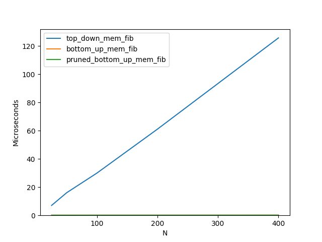
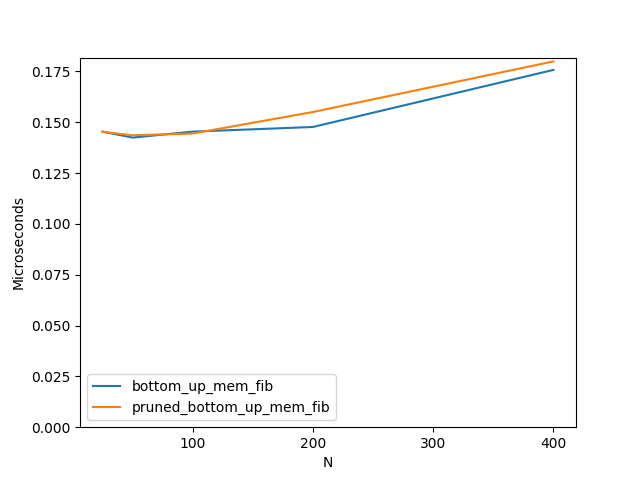
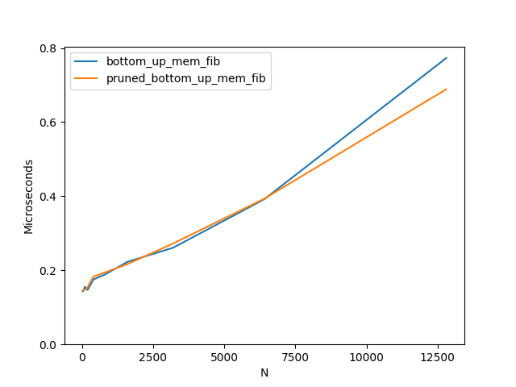

I came across an MIT lecture series on dynamic programming and went on to practice the ideas using the skillset I currently have. This came out to practicing typing, decorators, recusion, and time complexity of recursive functions. I had a lot of fun razing my computer's stack and eagerly watching the terminal for output for hours (alright that wasn't fun). Turns out the OG fibonacci function is disgustingly inefficient. I learned that along with algorithm complexity and cache friendlyness, reducing function calls is a good way to increase performance across the board. 

------------------------------------------------------------------------------------------------------------------------------------------------------------------

It turns out that the very first way we normally calculate fibonacci numbers has a time complexity of O(φn), where φ (phi) is the golden ratio and n is the position of the requested fibonacci number. When calling fib(n) once it will call itself twice, fib(n-1) and fib(n-2). If we keep expanding this tree, fib(n-1) calls fib(n-2) and fib(n-3) while fib(n-2) will call fib(n-3) and fib(n-4). Can you see the problem? We are repeating the same calculations over and over. We will find the (n-2) value twice, the (n-3) value three times, the (n-4) values 5 times and the (n-5) value 8 times. [1,1,2,3,5,8,...] Look familiar? The number of times we calculate a given value (n-k) is equal to fib(k+1). Fascinating, wacky, and most of all, not optimal!

We can avoid this repeat work by simply storing the result the first time we calculate it, ideally in a hashtable, and looking it up later on. In this way, we only need to calculate the fibonacci numbers 0->n once, reducing the time complexity to O(n).

Here we can see the compared performance of the three methods I wrote utilizing this idea of 'memoization'. The original fibonacci method .fib() is too slow to compare side by side.

All memoized methods       |  Bottom up approaches
:-------------------------:|:-------------------------:
  |  

As you can see, a lot of performance can be found if we switch from computing the fibonacci numbers top down to bottom up, even if both have the same algorithmic time complexity. The .top_down_mem_fib() and .bottom_up_mem_fib() approach only differ in their ordering of the computation done. Top down will calculate the fibonacci number in the order I previously went through, ie fib(n) -> fib(n-1) -> fib(n-2) ... fib(0), utilizing recusive calls to itself. On the other hand, the bottom up approach starts by calculating fib(0) and building its way up to fib(n). That slight difference means that it can be written as a for loop through a range of (n+1) as opposed to a recusive function.

 

The difference between these two methods is simply how much memory we carry with us. The non-pruned version remembers all fibonacci values up to and including fib(n). On the other hand, since finding fib(n) only requires knowledge of fib(n-1) and fib(n-2), we can erase our memory as we go, only ever storing two values at any one time! This does mean repeat calls to the pruned fib() method will have to do repeat work, but if we wanted to say, calculate fib(1000000), or linear time is acceptable vs constant time, the pruned method has a strong arguement for it.

I have heard of an algorithm that can compute fibonacci numbers in log(n) time (https://kukuruku.co/post/the-nth-fibonacci-number-in-olog-n/) and will have to dig into it, but for now, I'm happy with what I have learned.
